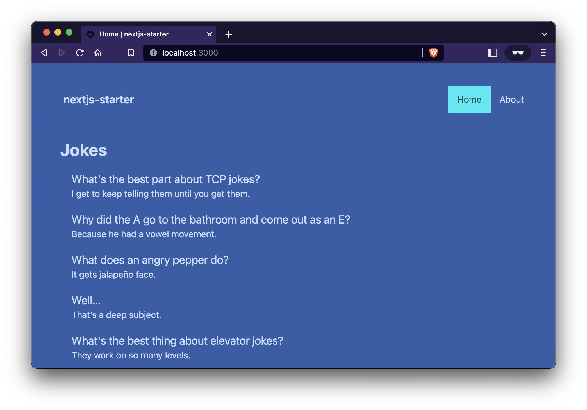

## nextjs-starter


Starter template for Next.js, with TypeScript, tailwindcss and daisyUI.



## Features

- Start with minimal [Next.js](https://nextjs.org/) app (using `npm`) via `npx create-next-app nextjs-starter --use-npm --ts` and simplify content
- Add [tailwindcss](https://tailwindcss.com/) and [daisyUI](https://daisyui.com)
- Add navigation, site layout and two pages
- Add Jest, React Testing Library, GitHub action to run tests, README badge, sample test
- Add Prettier config
- Add health check endpoint (`/api/health`)
- Add placeholder `favicon.ico`

## Run locally

```bash
yarn
yarn dev
```

Open [http://localhost:3000](http://localhost:3000) with your browser to see the result.

## Run tests

```bash
yarn
yarn test
```
